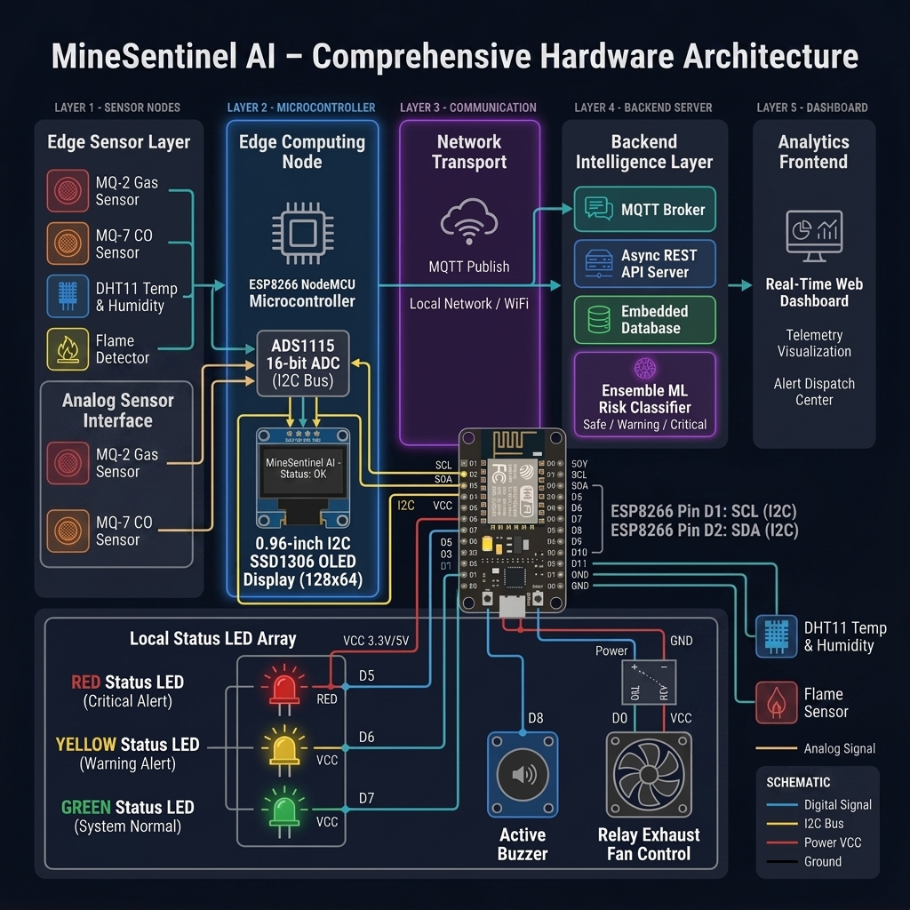
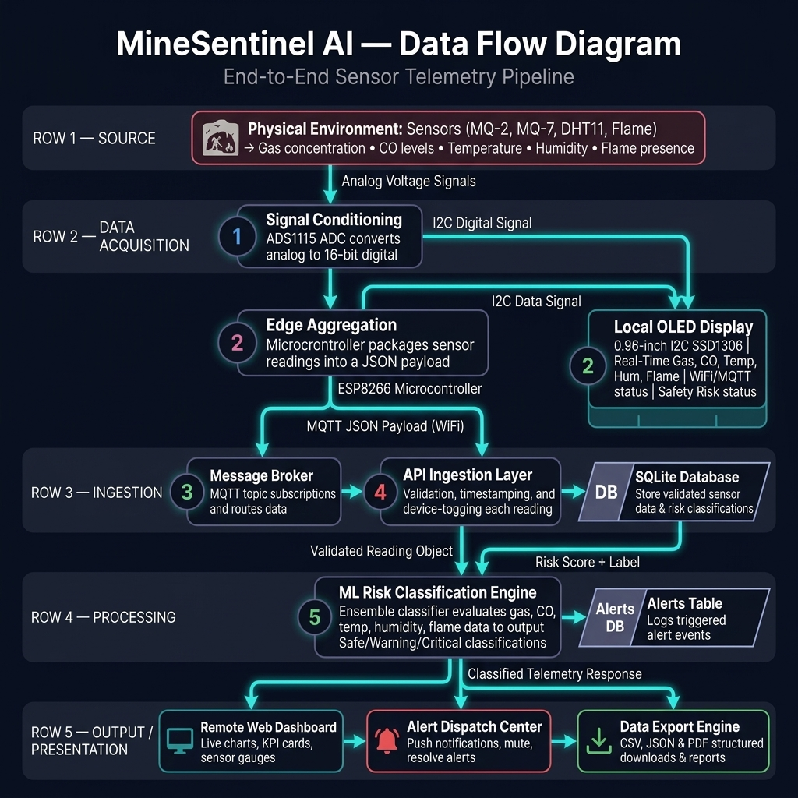
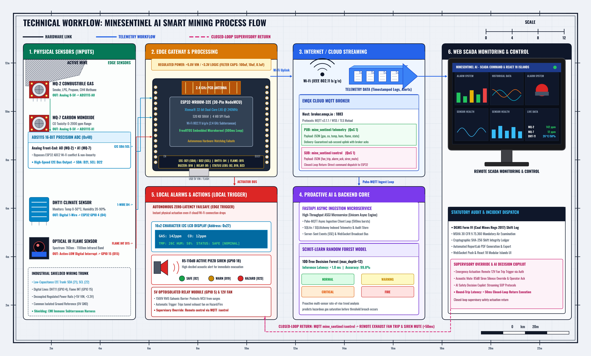

# MineSentinel AI — Technical Evaluation Report

MineSentinel AI is a real-time mine safety monitoring and automated hazard dispatch platform. This document serves as a technical evaluation report outlining the system architecture, hardware specifications, data telemetry pipelines, and machine learning components.

---

## 1. Executive Summary
Underground mining poses significant risks due to toxic gas build-up, carbon monoxide leaks, thermal stress, and fires. MineSentinel AI addresses these hazards through an integrated IoT and machine learning approach:
- **Continuous Edge Telemetry:** Low-power edge sensors gather micro-climate and toxicity metrics.
- **Local Edge Display:** Integrated 0.96" I2C SSD1306 OLED display for instant local visual feedback, Wi-Fi/MQTT status, and prominent emergency alerts at the physical site.
- **Async Ingestion & Dispatch:** High-throughput backend processes and logs sensor events in sub-milliseconds.
- **AI Classification:** Multi-class Ensemble Classifier predicts safety risk categories (Safe, Warning, Critical) on live telemetry data.
- **Interactive Control Room Dashboard:** Web interface displaying live feeds, safety charts, and active alert resolution flows.

---

## 2. Hardware Architecture & Specifications

The physical edge node consists of specialized gas, climate, and flame sensors coupled to an ESP32 microcontroller via a high-resolution analog-to-digital converter, alongside a local 16x2 I2C LCD display interface.

### Component Mapping
- **Microcontroller:** ESP32 Dev Module (30-Pin) + Breakout Expansion Shield.
- **Analog-to-Digital Precision:** ADS1115 16-bit ADC (I2C Bus, Address `0x48`).
- **Local Visual Output:** 16x2 Character LCD Display with PCF8574 I2C Backpack (Address `0x27`).
- **Gas Detection:** MQ-2 Sensor (LPG, Propane, Hydrogen, Methane, Smoke).
- **Carbon Monoxide Detection:** MQ-7 Sensor (CO levels).
- **Climate Monitoring:** DHT11 Sensor (Temperature & Humidity).
- **Flame Detection:** Infrared Optical Flame Sensor.
- **Visual & Audio Alarm Units:** Active Buzzer (5V) & Tri-Color status LEDs (Red, Yellow, Green).
- **Ventilation Actuation:** Relay Module & DC Exhaust Fan.

---

## 3. Telemetry Pipeline & Data Flow

Sensor readings flow from the physical environment to both the local 16x2 LCD display and the control room web dashboard through a multi-stage real-time data pipeline.

### Data Telemetry Stages
1. **Acquisition & Local Rendering:** Analog values are digitized by the 16-bit ADC, evaluated by the ESP32 edge client, and instantly rendered onto the local 16x2 LCD display (showing Gas, CO, Temp, Hum, Flame, Wi-Fi/MQTT status, and Safety Risk status).
2. **Ingestion (MQTT):** Encrypted JSON telemetry packets are published to the message broker over local WiFi.
3. **Processing (FastAPI backend):** The API server parses packets, saves them to SQLite database tables, and forwards them to the ML risk classifier.
4. **Classification:** The ML engine evaluates readings and appends a derived risk status (Safe, Warning, Critical).
5. **Presentation:** The remote web dashboard polls the backend `/api/status` and `/api/readings` endpoints to update visual indicators, logs, and interactive line charts.

---

## 4. Logical System Architecture

For a formal engineering perspective, the system is separated into three distinct logical boundaries: Hardware Layer (Sensors, ESP32, 16x2 LCD Local Display, LEDs, Buzzer, Fan), Software / Server Layer, and the Remote Presentation Layer (Web Dashboard).

---

## 5. Automated Safety Protocols & Risk Matrices

When the edge node or machine learning model triggers an alert classification:
- **Safe:** Green LED turns on. Local OLED displays `Status: SAFE [Nominal]` alongside live readings. System logs standard telemetry.
- **Warning:** Yellow LED and Relay Exhaust Fan turn on. Local OLED displays `WARNING: Elevated Levels!`. API issues alert notification for operator review.
- **Critical (Gas Leak / Fire):** Red LED, Relay Exhaust Fan, and Active Buzzer sound go HIGH. Local OLED displays an inverted prominent emergency message (`!! EMERGENCY: FIRE !!` or `! CRITICAL HAZARD !`). Emergency alert details are logged, and an operator dispatch warning is pushed to the web dashboard screen.

---
*Report generated on:* **September 1, 2026**
*System Version:* **v2.5 (OLED Integrated)**

