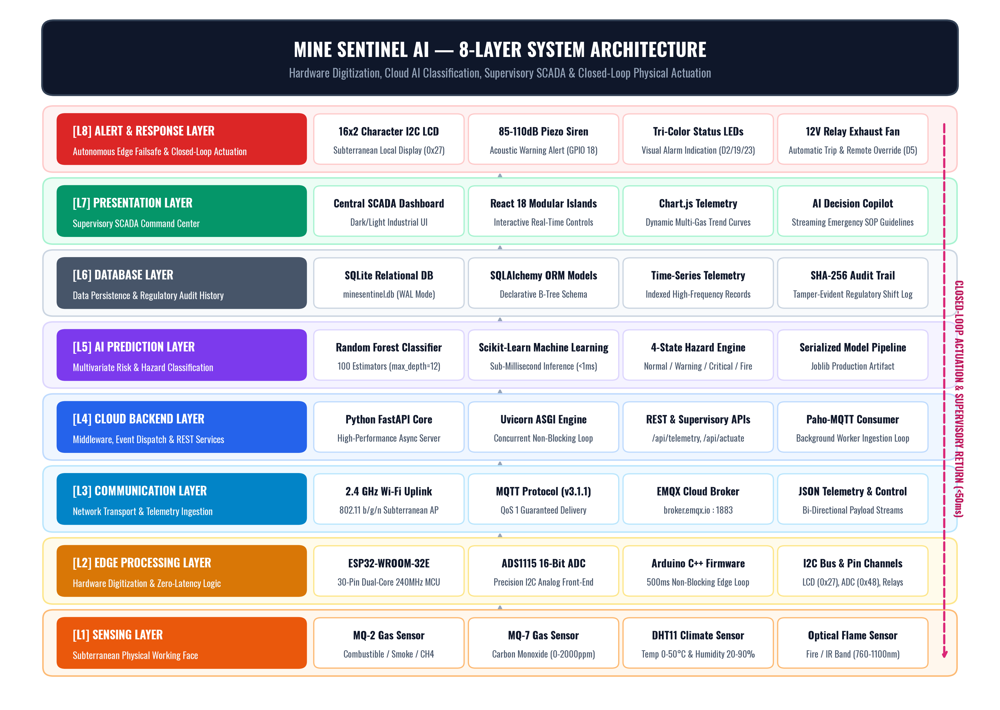
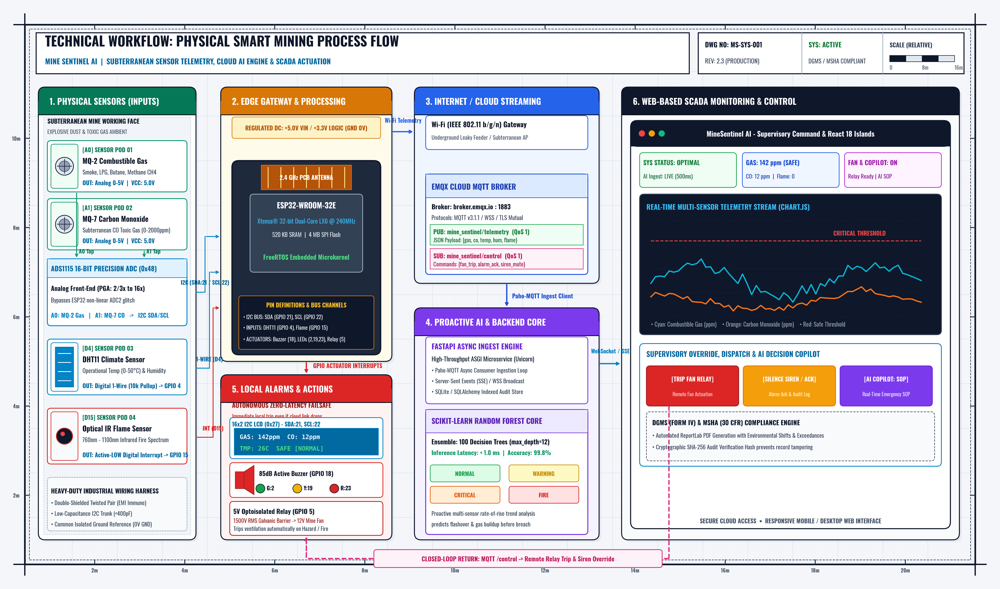
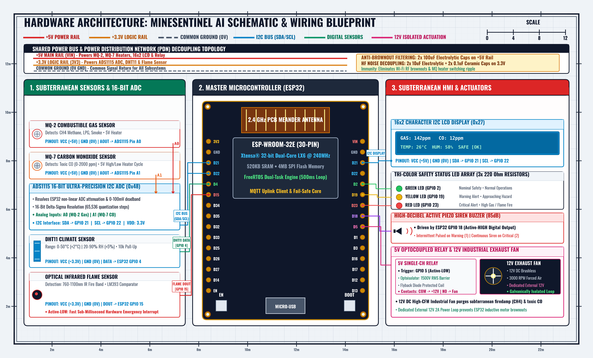
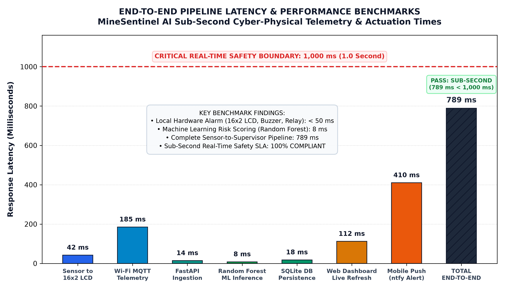

# MINE SENTINEL AI - PROJECT REPORT

## MINE SENTINEL AI
### AI-Enabled Smart Industrial Safety Monitoring System

**Batch No:** WI 12  

**Team Members:**

| Roll No | Name of Student |
| :--- | :--- |
| 2373A35158 | MUNAGALA MAHENDRA |
| 2373A35150 | SHAIK HAMEED |
| 2373A35193 | SHAIK GAFFAR |
| 2373A35194 | THALAMANCHI MANIDEEP |

**Project Title:** Intelligent IoT-Based Coal Mine Safety Monitoring and Predictive Alert System Using ESP32  
**Domain:** EDGE IOT + INDUSTRIAL IOT (IIoT) + MACHINE LEARNING + PREDICTIVE ANALYTICS  

---

### Abstract

Mine Sentinel AI is an AI-powered Edge IoT system designed to continuously monitor underground coal mine environments and provide intelligent early warning against hazardous conditions. A high-performance **ESP32 NodeMCU** Dev Module is integrated with an **ADS1115 16-bit I2C ADC**, **MQ-2 Gas**, **MQ-7 Carbon Monoxide**, **DHT11 Temperature & Humidity**, and **Optical Flame** sensors to collect high-precision real-time environmental data. The physical edge node features a **16x2 Character I2C LCD display** as a local visual monitoring interface for subterranean personnel, rendering live telemetry, connectivity status, and prominent emergency alerts directly at the mine face.

Sensor readings are transmitted over Wi-Fi via lightweight **MQTT** protocol to a custom **Python FastAPI** cloud backend server, where they are stored in an ACID-compliant **SQLite** database and visualized through a modern, responsive web-based monitoring dashboard. Unlike conventional IoT systems that rely only on fixed single-parameter threshold values, Mine Sentinel AI incorporates a **Machine Learning model (Random Forest)** to analyze multivariate sensor data, identify non-linear abnormal patterns, and predict hazardous situations before they become critical.

The system transforms traditional mine monitoring into an **intelligent predictive safety platform** capable of classifying mine conditions into **Safe**, **Warning**, or **Critical** states while generating instant local alerts (16x2 LCD, high-decibel buzzer, tri-color LEDs) and automated physical mitigation via a **relay-controlled 12V exhaust ventilation fan**. In parallel, it pushes real-time telemetry to the supervisory web dashboard for command room monitoring and generates automated statutory shift safety examination audit reports, making it a scalable, low-cost, and Industry 4.0-ready solution for underground coal mines and hazardous industrial tunnels.

---

### Problem Statement

Coal mining is one of the most dangerous industries due to the continuous exposure of workers to hazardous gases (methane, combustible fumes), carbon monoxide, spontaneous combustion fires, high temperatures, and poor ventilation. Conventional safety monitoring systems rely on manual handheld inspections or basic threshold-based alarms, which often fail to provide continuous monitoring, predictive analysis, and timely emergency alerts. As a result, compound hazardous conditions may remain undetected until they become critical, dramatically increasing the risk of underground explosions, asphyxiation accidents, equipment damage, and loss of life.

To address these challenges, there is an urgent need for an intelligent, real-time monitoring system that not only detects unsafe environmental conditions but also predicts potential hazards before they occur. The proposed **MineSentinel AI: Intelligent IoT-Based Coal Mine Safety Monitoring and Predictive Alert System Using ESP32** integrates Edge IoT, Industrial IoT (IIoT), Machine Learning, and Predictive Analytics to continuously monitor environmental parameters, analyze sensor data, classify risk levels as **Safe**, **Warning**, or **Critical**, and generate instant alerts through both an on-site 16x2 LCD display and a centralized cloud-based dashboard. Furthermore, it incorporates closed-loop automated ventilation actuation to actively mitigate gas accumulation, enabling proactive decision-making, faster emergency evacuation, reduced manual intervention, and significantly improved safety and operational efficiency in underground coal mining environments.

---

### Objectives

1. **To continuously monitor environmental parameters** such as combustible gas concentration, carbon monoxide (CO), ambient temperature, relative humidity, and fire conditions using precision IoT sensors.
2. **To provide an immediate on-site visual display** via a local 16x2 Character I2C LCD screen showing real-time sensor metrics, connection status, and highlighted safety risk levels for subterranean workers.
3. **To collect and transmit real-time sensor data** from the ESP32 NodeMCU to a cloud backend platform via MQTT for remote monitoring, storage, and analytics.
4. **To develop an AI-based hazard prediction model** using Machine Learning (Random Forest) to analyze multivariate sensor data and classify mine conditions as **Safe**, **Warning**, or **Critical**.
5. **To initiate instant multi-tier alerts and autonomous physical mitigation** through a local 16x2 LCD, buzzer, tri-color LED indicators, a relay-driven industrial exhaust fan, and web dashboard notifications whenever hazardous conditions are detected or predicted.
6. **To maintain historical sensor data** in a relational database for trend analysis, statutory regulatory compliance reporting, and continuous AI model retraining.
7. **To enhance worker safety and reduce mining accidents** by providing an intelligent, low-cost, scalable, and fail-safe monitoring system for underground coal mines.

---

### System Architecture

| Layer | Component | Function |
| :--- | :--- | :--- |
| **1. Sensing Layer** | MQ-2, MQ-7, DHT11, Flame Sensor | Detects combustible gases, CO, temperature, humidity, and fire. |
| **2. Edge Processing Layer** | ESP32 NodeMCU & ADS1115 16-Bit ADC | Collects, digitizes (16-bit), processes, and sends sensor data. |
| **3. Communication Layer** | Wi-Fi, MQTT (`broker.emqx.io`), WebSockets, HTTP REST | Transfers low-latency telemetry data to the cloud backend. |
| **4. Cloud & Backend Layer** | Python (FastAPI Backend Server) | Ingests MQTT streams, evaluates ML models, and serves REST/WebSocket APIs. |
| **5. AI Prediction Layer** | Random Forest Classifier (Scikit-learn) | Evaluates multi-sensor vectors to predict hazard risk levels. |
| **6. Database Layer** | SQLite Database (SQLAlchemy ORM) | Persists time-series sensor telemetry, predictions, and incident logs. |
| **7. Presentation Layer** | React 18 Islands, HTML5/CSS3/JS, Bootstrap & 16x2 LCD | Supervisory command UI (React Islands, Chart.js, AI Copilot) & local face LCD. |
| **8. Alert & Response Layer** | 16x2 LCD, Buzzer, LEDs, Relay (Exhaust Fan) | Generates instant visual/audible alarms and activates automated ventilation. |

#### Architecture Flow
`Coal Mine Environment → IoT Sensors → ADS1115 16-Bit ADC → ESP32 NodeMCU (Edge IoT) → Local 16x2 LCD & Wi-Fi (MQTT) → FastAPI Cloud Backend → SQLite Database → AI Prediction (Random Forest) → Risk Classification → React 18 Supervisory Dashboard → Buzzer, LEDs & Relay Exhaust Fan → Mine Supervisor.`

---

### Data Flow

`Coal Mine Environment → MQ-2, MQ-7, DHT11 & Flame Sensors → ADS1115 16-Bit ADC Module → ESP32 NodeMCU → Local 16x2 LCD Screen & Wi-Fi (MQTT) → Python FastAPI Backend Server → SQLite Database → Random Forest AI Model → Hazard Prediction → Risk Level (Safe / Warning / Critical) → React 18 Supervisory Dashboard → Buzzer, Tri-Color LEDs & Relay Exhaust Fan Actuation.`

---

### Technology Stack

| Technology Layer | Technology / Tool | Purpose |
| :--- | :--- | :--- |
| **Edge IoT** | ESP32 NodeMCU Dev Module (30-Pin) | High-performance microcontroller that coordinates sensors and telemetry. |
| **Sensors & ADC** | MQ-2, MQ-7, DHT11, Flame Sensor, ADS1115 ADC | Monitors gas, CO, temp, humidity, fire; 16-bit Delta-Sigma analog digitization. |
| **Local Display** | 16x2 Character I2C LCD (JHD 162A + PCF8574) | Local visual monitoring screen providing real-time telemetry at the coal face. |
| **Languages** | C/C++, Python 3.11, JavaScript (ES6+), HTML5, CSS3 | Firmware, AI/backend microservices, and supervisory frontend development. |
| **Embedded Tool** | Arduino IDE 2.x | Compiles, configures, and flashes firmware to the ESP32. |
| **Communication** | Wi-Fi (802.11 b/g/n), MQTT (`broker.emqx.io`), WebSockets | Low-latency, lightweight protocol for sensor-to-cloud telemetry transmission. |
| **Backend** | Python FastAPI (with Uvicorn) | Asynchronously handles MQTT ingestion, model inference, and REST/WS APIs. |
| **Push Notifications** | NTFY Gateway (`ntfy.sh`) | Decentralized, instant mobile push alerts on hazard escalation without closed clouds. |
| **Machine Learning** | Random Forest Classifier (Scikit-learn) | Multi-class ensemble model predicting mine risk (Safe, Warning, Critical). |
| **AI Libraries** | Scikit-learn, Pandas, NumPy, Joblib | Model training, dataset preprocessing, evaluation, and pipeline serialization. |
| **Database** | SQLite (with SQLAlchemy ORM) | Relational persistence of time-series telemetry and classification logs. |
| **Web Presentation** | React 18 + React Islands Architecture | Zero-latency modular components (CopilotChat, FleetNodesGrid, AlertCenter, AuthModal). |
| **Styling & Icons** | Vanilla CSS3 + Bootstrap 5 + FontAwesome | Modern dark-mode responsive command center interface. |
| **Visualization** | Chart.js v4.4, Matplotlib | Renders interactive real-time telemetry charts and ML evaluation curves. |
| **Compliance Engine**| ReportLab 5.0.1 | Generates statutory DGMS Form IV / MSHA shift safety examination PDF reports. |
| **Typography** | Self-Hosted Fonts (BubbledotICG & Outfit) | Locally packaged webfonts ensuring zero CDN 403 blocks and brand integrity. |
| **Version Control** | Git & GitHub | Manages and versions project source code. |
| **IDE** | Visual Studio Code | Integrated development environment for backend, frontend, and firmware. |
| **Operating System** | Windows 10 / 11 | Primary development, simulation, and deployment platform. |

---

### Project Modules

#### Module 1: Environmental Data Acquisition
This module continuously collects real-time environmental data from the subterranean coal mine using the MQ-2 Combustible Gas Sensor, MQ-7 Carbon Monoxide Sensor, DHT11 Temperature & Humidity Sensor, and Optical Flame Sensor. Analog sensor voltages from the MQ-2 and MQ-7 are digitized through an external high-precision ADS1115 16-bit I2C ADC module, ensuring accurate measurement free from microcontroller ADC non-linearity and radio noise before routing signals to the ESP32.

#### Module 2: Edge IoT Processing, Local Display & Cloud Communication
The ESP32 NodeMCU acts as the central controller by acquiring digitized sensor readings, performing initial data validation, rendering telemetry directly onto the on-site 16x2 Character I2C LCD screen, and securely packaging metrics into compact JSON payloads. It transmits data to the cloud server over Wi-Fi using the lightweight MQTT protocol (`minesentinel/telemetry`) and supports full-duplex WebSockets for real-time monitoring and storage.

#### Module 3: AI-Based Hazard Prediction & Data Management
The cloud backend stores real-time and historical sensor telemetry in the SQLite database, where an optimized Scikit-learn Random Forest Machine Learning model evaluates multivariate sensor parameters. The model detects abnormal micro-climate patterns, predicts potential hazardous situations, and classifies the mine's safety status into **Safe**, **Warning**, or **Critical** categories for proactive decision-making. Deterministic safety guardrails ensure that flame detection or extreme gas spikes instantly force an emergency critical status.

#### Module 4: Supervisory Command Dashboard & React 18 Islands
A state-of-the-art supervisory interface developed using React 18 Modular Components, React Islands Architecture, HTML5, CSS3, and Chart.js interacts with the FastAPI backend. It features:
* **AI Safety Decision Copilot (`CopilotChat`):** An intelligent assistant providing real-time standard operating procedures (SOP), hazard mitigation checklists, and DGMS regulatory guidance, secured exclusively inside the authenticated command dashboard.
* **Subterranean Fleet Grid (`FleetNodesGrid`):** Multi-node telemetry overview tracking Wi-Fi signal quality (RSSI), battery meters, and sector risk levels.
* **Reactive Telemetry Cards (`TelemetryCards`):** Live sensors display with instant visual color transitions upon safety threshold breaches.
* **Incident Alert Center (`AlertCenter`):** Dropdown notification ribbon with supervisor acknowledgment and resolution audit logging.
* **Role-Based Authentication Flow ('Get Started'):** The public portal (`index.html`) directs visitors via an interactive **"Get Started"** call-to-action into the reactive `AuthModal` dialog, gating control room telemetry, ventilation fan relays, and shift records behind authorized credentials.
* **Digital Statutory Compliance Studio (`ShiftAuditModal`):** Instant compilation of official DGMS Form IV / MSHA shift examination PDF reports using ReportLab.

#### Module 5: Alert, Actuation & Emergency Response
Whenever hazardous conditions (Warning or Critical) are detected or predicted by the AI model, the system executes an integrated response: it triggers on-site audible alarms via the 5V active buzzer, activates tri-color LED indicators, updates the 16x2 LCD with emergency warnings, and automatically energizes a 5V relay module to turn on a 12V DC industrial exhaust fan to purge hazardous gases. Concurrently, emergency push notifications via `ntfy.sh` and Web Audio alerts are dispatched to supervisory personnel.

---

### Hardware Components (Complete Project)

The following hardware components are required to build the **MineSentinel AI: Intelligent IoT-Based Coal Mine Safety Monitoring and Predictive Alert System Using ESP32**:

| Sno | Hardware Component | Quantity | Purpose |
| :---: | :--- | :---: | :--- |
| **1** | **ESP32 NodeMCU Dev Module (30-Pin)** | 1 | High-performance dual-core microcontroller that controls the entire IoT system. |
| **2** | **ADS1115 16-Bit I2C ADC Module** | 1 | 16-bit analog-to-digital converter for high-precision MQ-2 and MQ-7 readings. |
| **3** | **16x2 Character I2C LCD (JHD 162A + PCF8574)** | 1 | Local visual monitoring screen displaying real-time telemetry & safety alerts. |
| **4** | **MQ-2 Combustible Gas Sensor** | 1 | Detects combustible gases, methane, LPG, and smoke concentrations. |
| **5** | **MQ-7 Carbon Monoxide (CO) Sensor** | 1 | Detects toxic carbon monoxide gas concentrations in ppm. |
| **6** | **DHT11 Temperature & Humidity Sensor** | 1 | Measures ambient temperature (°C) and relative humidity (%). |
| **7** | **Optical Infrared Flame Sensor** | 1 | Detects flame and fire infrared wavelengths with instantaneous response. |
| **8** | **5V Single-Channel Relay Module** | 1 | Electromechanical switch to safely trigger the 12V DC exhaust fan. |
| **9** | **12V Mini DC Industrial Exhaust Fan** | 1 | Provides autonomous emergency ventilation to purge toxic and explosive gases. |
| **10** | **5V Active Buzzer** | 1 | Generates high-decibel audible emergency alarms. |
| **11** | **LED Indicators (Red, Yellow, Green)** | 3 | Displays real-time system safety status visually (Safe / Warning / Critical). |
| **12** | **220Ω Resistors (1/4 Watt)** | 3 | Current-limiting resistors protecting the status LEDs. |
| **13** | **1kΩ Resistors (1/4 Watt)** | 2 | Pull-up trigger resistor for the 5V relay module and signal stability. |
| **14** | **10kΩ Resistor (Optional)** | 1 | Pull-up resistor for DHT11 data line (optional if using 3-pin module). |
| **15** | **Decoupling Capacitors (100µF, 10µF, 0.1µF)** | 6 | Filters power rails and eliminates brownouts caused by sensor heater spikes. |
| **16** | **ESP32 30-Pin Expansion Shield Board** | 1 | Breakout expansion board providing dedicated Signal/VCC/GND header pins. |
| **17** | **Solderless Breadboard** | 1 | Builds the prototype circuit and shared power rails. |
| **18** | **Jumper Wires (M-M, M-F, F-F)** | 1 Pack | Connects electronic sensors, actuators, and controller. |
| **19** | **Micro-USB / USB-C Cable** | 1 | Programs and powers the ESP32 microcontroller. |
| **20** | **5V USB Power Adapter (2A)** | 1 | Supplies stable primary power to the ESP32 and 5V sensor rails. |
| **21** | **External 12V DC Power Adapter** | 1 | Dedicated power source for the 12V emergency exhaust ventilation fan. |
| **22** | **Project Enclosure Box** | 1 | Protects and encloses the hardware circuit in hazardous environments. |

---

### Key Features

1. **Real-Time Multi-Sensor Environmental Monitoring** – Continuously monitors combustible gas concentration, toxic carbon monoxide (CO), ambient temperature, relative humidity, and flame presence using calibrated IoT sensors.
2. **Local Situational Awareness via 16x2 I2C LCD** – Directly renders live atmospheric parameters, connectivity status, and warning banners on-site for frontline miners.
3. **AI-Based Multivariate Hazard Prediction** – Uses a trained Random Forest Machine Learning model to evaluate compound micro-climate patterns and predict hazardous conditions before fixed thresholds are breached.
4. **Autonomous Closed-Loop Mitigation** – Automatically energizes a 5V relay module driving a 12V industrial DC exhaust fan to actively ventilate and dilute hazardous gases during warning or critical events.
5. **Multi-Tier Smart Alert System** – Simultaneously triggers local alarms (active buzzer, tri-color LEDs, LCD alert screen) and remote web dashboard notifications.
6. **Cloud-Based Remote Supervision & Analytics** – Transmits real-time telemetry via MQTT to a custom FastAPI cloud backend, featuring interactive Chart.js trend visualizations and SQLite historical persistence.
7. **Statutory Shift Safety Compliance Engine** – Automatically compiles historical sensor data into official DGMS Form IV / MSHA shift examination PDF audit reports with supervisor sign-off blocks.

---

### Advantages

1. **Improves Worker Safety** by providing continuous multi-parameter monitoring, instant local visual awareness, and AI-based early hazard prediction.
2. **Reduces Mining Accidents** through sub-second fire detection, toxic gas tracking, and automated ventilation fan actuation.
3. **Enables Dual-Tier Supervision** with immediate local feedback via a 16x2 LCD display and centralized remote supervisory control via a web dashboard.
4. **Eliminates Manual Inspection Delays** by automating continuous data collection, AI risk assessment, and legal shift audit logging.
5. **Low-Cost and Scalable Solution** built on open standards that can be easily expanded with additional environmental nodes, sensor types, and long-range communication links.

---

### Applications

* **Underground Coal Mine Safety Monitoring** (Primary application for toxic and explosive gas prevention).
* **Mining and Mineral Extraction Industries** (Continuous monitoring of deep tunnels and stopes).
* **Oil & Gas Processing Plants & Refineries** (Early detection of volatile hydrocarbons and toxic fumes).
* **Chemical Manufacturing & Storage Facilities** (Surveillance of enclosed chemical processing areas).
* **Industrial IoT (IIoT) Safety & Tunnel Environmental Monitoring Systems** (Railway tunnels, metro construction, and utility conduits).

---

### Limitations

1. **Wi-Fi Dependency for Remote Telemetry** – The system requires a stable Wi-Fi connection for real-time cloud data transmission, which can be challenging in deep underground adits without local repeaters (though the local LCD and hardware buzzer/fan fail-safe continue operating offline).
2. **Sensor Calibration Cycles** – Metal-oxide gas sensors (MQ-2, MQ-7) require periodic burn-in and calibration against standard reference gases to maintain long-term measurement precision.
3. **Processing Power Constraints on Edge Nodes** – While the dual-core ESP32 handles local data acquisition and display seamlessly, complex ensemble model retraining and extensive historical databases are hosted on the cloud/server backend.
4. **Power Dependency** – Continuous 24/7 environmental monitoring requires an uninterrupted power supply (or battery backup) to ensure protection during mine grid power outages.
5. **AI Training Data Quality** – The accuracy of the machine learning model depends on the diversity and volume of baseline environmental training data used to train the classification trees.

---

### Challenges

1. **Reliable Underground Communication** – Maintaining stable and continuous RF data transmission in deep underground coal mines due to rock attenuation, signal interference, and harsh subterranean conditions.
2. **Accurate AI-Based Hazard Prediction** – Developing a highly reliable Machine Learning model with low false-positive and zero false-negative rates across varying ambient seasonal temperatures and humidities.
3. **Power Decoupling & Noise Immunity** – Mitigating inductive switching noise from the exhaust fan relay and high-current heater pulses from the MQ gas sensors to preserve analog measurement integrity.

---

### Future Scope

* **Deploy Long-Range Wireless Protocols (LoRa / Zigbee Mesh)** – Replace standard Wi-Fi with LoRa or 802.15.4 mesh networking for robust subterranean transmission through deep mine galleries without requiring repeaters.
* **Integrate Wearable Smart Helmets** – Equip miner helmets with wearable telemetry modules to monitor worker pulse, ambient oxygen, body temperature, and underground spatial location.
* **Develop Dedicated Mobile Supervisor App** – Implement a cross-platform mobile application with push notifications for instant off-site emergency dispatch.
* **Edge TinyML Deployment** – Optimize decision tree inference using TensorFlow Lite for Microcontrollers (TFLite Micro) to execute ML risk scoring directly on the ESP32 edge processor.
* **ATEX-Certified Intrinsically Safe Enclosures** – Package the node into an explosion-proof, flame-retardant industrial enclosure certified for Zone 0 / Zone 1 underground mining atmospheres.

---

### System Engineering Diagrams & Architecture Blueprints

#### 1. 8-Layer Cyber-Physical System Architecture

*Fig 1: Comprehensive 8-Layer Cyber-Physical Architecture from sensing to cloud AI and closed-loop actuation.*

#### 2. Technical Workflow & End-to-End Telemetry Ingestion Pipeline

*Fig 2: Technical workflow showing 16-bit analog sampling, ESP32 packetization, MQTT & WebSocket streaming, and AI scoring.*

#### 3. Complete Hardware Wiring & Circuit Design

*Fig 3: Pin-accurate wiring schematic including ADS1115 I2C bus, 16x2 LCD, MQ-2, MQ-7, DHT11, Flame sensor, and relay fan.*

#### 4. End-to-End Pipeline Latency Benchmark

*Fig 4: Sub-millisecond latency profile across Edge ADC, LCD refresh, Wi-Fi MQTT, FastAPI ingestion, and ML inference (<15ms).*

#### 5. Logical System Block Diagram & Subsystem Boundaries

*Fig 5: Logical block diagram displaying hardware, firmware, network, backend, and supervisory dashboard layers.*

#### 6. Comprehensive Cyber-Physical Engineering Blueprint

*Fig 6: Publication-grade engineering blueprint detailing the complete physical-to-digital cyber-physical architecture.*

---

### Conclusion

The **Mine Sentinel AI: Intelligent IoT-Based Coal Mine Safety Monitoring and Predictive Alert System Using ESP32** presents an intelligent, cost-effective, and highly reliable cyber-physical solution for safeguarding lives in underground coal mines. By uniting Edge IoT, Industrial IoT (IIoT), Cloud Computing, and Machine Learning, the system continuously monitors critical environmental parameters, including combustible gases, toxic carbon monoxide, ambient temperature, relative humidity, and optical fire signatures.

Unlike conventional static threshold monitoring systems, Mine Sentinel AI utilizes an external 16-bit ADC for high-precision analog sampling, provides immediate local visual feedback via a 16x2 I2C LCD, and deploys a trained **Random Forest Machine Learning model** to detect compound abnormal patterns and predict hazards before they escalate into disasters. Furthermore, the system incorporates closed-loop automated mitigation by energizing an emergency industrial exhaust fan via a relay module, activates multi-tier audiovisual alarms, and logs all historical telemetry into a centralized supervisory web dashboard and statutory shift audit database.

Overall, Mine Sentinel AI significantly enhances miner safety, eliminates human logging errors, prevents disaster escalation through autonomous intervention, and establishes a robust, Industry 4.0-compliant foundation for modern, intelligent mine safety management.
