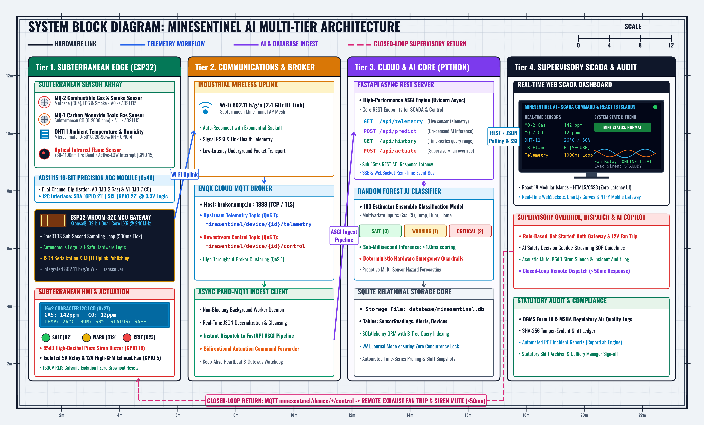

# MineSentinel AI — Software Execution & Interface Walkthrough Guide

Welcome to the comprehensive, step-by-step software and interface guide for **MineSentinel AI** — an industrial-grade cyber-physical safety monitoring system engineered for underground coal mining operations.

---

## 1. System Overview & Architecture

MineSentinel AI unites physical edge microcontrollers, high-precision analog-to-digital signal conversion, cloud microservices, machine learning classification, and an interactive supervisory SCADA dashboard.



### Telemetry Pipeline Summary
1. **Edge Sampling:** Dual-core ESP32 digitizes analog sensor feeds (MQ-2 Gas, MQ-7 Carbon Monoxide) through an ADS1115 16-bit Delta-Sigma ADC alongside digital DHT11 (Temperature/Humidity) and optical infrared flame detectors.
2. **Wireless Broker:** Payloads are serialized to JSON and broadcast via MQTT over Wi-Fi (`broker.emqx.io:1883`) on topic `minesentinel/device/{id}/telemetry`.
3. **Cloud Ingest & ML:** Asynchronous Python **FastAPI** backend ingests telemetry, runs a 100-tree **Random Forest ML model**, enforces deterministic fail-safe emergency rules, and persists records to an ACID-compliant **SQLite** database.
4. **Supervisory Presentation:** A web command center featuring **React 18 Modular Islands** (`ReactCopilot`, `AlertCenter`, `FleetNodesGrid`) and Chart.js streams live data to control room personnel.

---

## 2. Software Launch & Execution Guide

You can run the entire platform on your local machine using the built-in simulator or connected to real hardware.

### Option A: One-Click Launch (Recommended for Windows)

In the project root folder, two batch scripts are ready to execute:

```
Mine sentinel ai/
  ├── start_backend.bat     <-- 1. Double-click to start FastAPI & Web Server
  └── start_simulator.bat   <-- 2. Double-click to start Sensor Telemetry Simulator
```

1. **Double-click `start_backend.bat`:**
   * Automatically activates the isolated Python virtual environment (`venv`).
   * Boots the FastAPI ASGI server on port `8000`.
   * Establishes a background MQTT client subscribing to `minesentinel/device/+/telemetry`.
2. **Double-click `start_simulator.bat`:**
   * Generates continuous simulated edge sensor telemetry (Safe, Warning, Critical gas surges, and Fire states).

---

### Option B: Terminal Command-Line Launch

#### Step 2.1 — Start the FastAPI Server (Terminal 1)
Open **PowerShell** in the root workspace:
```powershell
cd "c:\Users\munag\OneDrive\Desktop\Mine sentinel ai"
.\venv\Scripts\activate
python backend\main.py
```
*Expected Console Output:*
```text
================================================================
   MineSentinel AI - Industrial Safety & Telemetry Server
   * Landing / Index Page:   http://127.0.0.1:8000
   * Operations Dashboard:   http://127.0.0.1:8000/dashboard.html
   * REST API Documentation: http://127.0.0.1:8000/docs
================================================================
Connected to MQTT Broker: broker.emqx.io:1883
Subscribed to topic: minesentinel/device/+/telemetry
```

> **Note:** Leave Terminal 1 running. The FastAPI server hosts both the backend REST/WebSocket endpoints and the entire frontend dashboard.

#### Step 2.2 — Start the Telemetry Simulator (Terminal 2)
Open a **second PowerShell window**:
```powershell
cd "c:\Users\munag\OneDrive\Desktop\Mine sentinel ai"
.\venv\Scripts\activate
python simulator\simulator.py
```

---

## 3. Web Interface Page-by-Page Guided Walkthrough

The platform includes two distinct web portals: the **Public Landing & Information Portal** and the **Supervisory Operations SCADA Dashboard**.

---

### Page 1: Public Landing Portal (`http://127.0.0.1:8000`)

Navigate to **http://127.0.0.1:8000** in your web browser.

```
┌─────────────────────────────────────────────────────────────────────────────┐
│  MINESENTINEL AI     [Home] [About] [Architecture] [Safety]   [Theme] [Sign In]│
├─────────────────────────────────────────────────────────────────────────────┤
│  [Full-Screen Subterranean Mining Video Background with Dark Overlay]      │
│                                                                             │
│               MineSentinel AI                                               │
│               Safety Designed To Evolve                                     │
│                                                                             │
│      [ Get Started (Auth Modal) ]           [ Learn More ]                  │
├─────────────────────────────────────────────────────────────────────────────┤
│  • Edge Telemetry Ingestion (MQ-2, MQ-7, ADS1115, DHT11)                    │
│  • AI Predictive Risk Engine (Random Forest Multi-Class)                    │
│  • Autonomous Alarm Dispatch & Evacuation Siren                             │
│  • Live SCADA Analytics & Statutory Compliance Logs                         │
├─────────────────────────────────────────────────────────────────────────────┤
│  [Floating React 18 AI Safety Assistant (Bottom-Right)]                     │
└─────────────────────────────────────────────────────────────────────────────┘
```

#### What to Try on This Page:
1. **Interactive Display Theme Switcher:**
   * In the top-right header, click the theme selector.
   * Switch between **Dark Mode** (*Obsidian Neon*), **Normal Mode** (*Slate Blue*), and **Light Mode** (*Daylight Clarity*). The entire DOM theme adapts instantly without reloading.
2. **Smooth Navigation Pill:**
   * Click **About Project** $\rightarrow$ reviews the operational rationale.
   * Click **Architecture** $\rightarrow$ displays the hardware specifications and sensor array mapping table.
   * Click **Safety Systems** $\rightarrow$ outlines the DGMS (Directorate General of Mines Safety) statutory compliance standards.
3. **Role-Based Authentication Gateway:**
   * Click the **"Get Started"** button in the hero area or **"Sign In"** in the navbar.
   * An authentication modal opens.
   * Choose your station role:
     * *Control Room Officer* (General supervisory access)
     * *Mine Safety Engineer* (Full actuator override permissions)
   * Click **Sign In** to proceed into the Operations Dashboard.
4. **Landing Page AI Safety Assistant:**
   * Click the floating robot badge in the bottom-right corner.
   * Ask queries about mine regulations or station readiness directly from the landing page.

---

### Page 2: Operations SCADA Dashboard (`http://127.0.0.1:8000/dashboard.html`)

Direct URL: **http://127.0.0.1:8000/dashboard.html**

This is the primary industrial operations command center where live telemetry streams are evaluated in real time.

```
┌──────────────────┬──────────────────────────────────────────────────────────┐
│ ▧ MINESENTINEL AI│ [Station: ESP32 Online] [Fan Override] [Siren Mute]      │
│                  │ [NTFY Push] [Alert Center (React 18)] [Theme] [Sign Out] │
├──────────────────┼──────────────────────────────────────────────────────────┤
│ OPERATIONS       │ 1. HERO STATUS & TELEMETRY METRIC CARDS                  │
│ • Monitoring     │    • Aggregate Mine Status: SAFE / WARNING / CRITICAL    │
│ • CAD Blueprint  │    • Combustible Gas (PPM)   • Carbon Monoxide (PPM)     │
│ • Live Video AI  │    • Temperature (°C)        • Humidity (% RH)           │
│ • Digital Twin   │    • Optical Flame Presence                              │
│ • Waveforms      ├──────────────────────────────────────────────────────────┤
│ • Single Gauges  │ 2. MINE CAD BLUEPRINT & SENSOR OVERLAY                   │
│                  │    • Vector schematic showing subterranean levels & adits│
│ SAFETY & AUDIT   ├──────────────────────────────────────────────────────────┤
│ • Events Log     │ 3. 2D MINE DIGITAL TWIN & EVACUATION MAP                 │
│ • Shift Audit PDF│    • Dynamic escape path arrows & refuge chamber bays    │
│                  ├──────────────────────────────────────────────────────────┤
│                  │ 4. STREAMING TELEMETRY CHARTS (Chart.js)                 │
│                  │    • Multi-curve waveforms (Live, 1h, 24h, 5d, 1m)       │
│                  ├──────────────────────────────────────────────────────────┤
│                  │ 5. STATUTORY AUDIT & DATA EXPORT MODALS                  │
│                  │    • DGMS Form IV PDF Generator • CSV Export Studio      │
└──────────────────┴──────────────────────────────────────────────────────────┘
```

#### Detailed Section Breakdown:

#### 1. Top Action Strip & Actuator Controls
* **Live Node Connectivity Badge:** Shows connection status, signal strength ($RSSI$), and packet drop rate for `ESP32_NODE_01`.
* **Exhaust Fan Override Button:** Triggers the closed-loop MQTT actuation pipeline to manually spin up the 12V ventilation fan (GPIO 5).
* **Acoustic Siren Silence Button:** Mutes the subterranean 85dB piezo buzzer (GPIO 18) during safe inspection windows.
* **Hazard Alert Center (React 18 Island):** Dynamic bell icon with real-time badge count. Click to view active incident cards with one-click resolution.
* **Mobile Push Alerts (NTFY):** Integrates with `ntfy.sh` for push notifications delivered to smartphones during critical events.

#### 2. Main Monitoring Telemetry Cards (`#analytics-section`)
* **Dynamic Hazard State Card:**
  * **SAFE** (Green): Gas $\le$ 450 ppm, CO $\le$ 50 ppm, Temp $\le$ 40°C, Flame = 0.
  * **WARNING** (Yellow): Moderate gas elevation or heat-stress accumulation.
  * **CRITICAL** (Red): Hazardous methane/CO threshold breach or positive optical flame detection.
* **Four Real-Time Sensor Telemetry Cards:** Each card displays current values, unit scales, trend arrows, and safe baseline ranges.

#### 3. Mine CAD Blueprint & Sector Station Nodes (`#mine-cad-section`)
* Industrial schematic displaying Level -100m Main Adit, Central Ventilation Shaft, and Sub-level Stopes.
* Click any station node on the schematic to display device health, firmware version, and battery metrics.

#### 4. 2D Mine Digital Twin & Dynamic Evacuation Map (`#digital-twin-section`)
* An interactive topological map displaying mine galleries, crosscuts, and refuge bays.
* **Dynamic Evacuation Routing:** When an emergency hazard occurs in a specific sector, animated evacuation arrows recalculate in real time to route miners away from toxic gas plumes toward safe refuge chambers.

#### 5. Real-Time Waveform Analytics (`#charts-section`)
* High-performance **Chart.js** telemetry curves tracking Combustible Gas, Carbon Monoxide, Temperature, and Humidity.
* **Time Range Toggles:** Switch between **Live (50s)**, **1 Hour**, **24 Hours**, **5 Days**, and **1 Month** history.
* **Export Studio:** Download historical readings directly to CSV.

#### 6. Single Sensor Radial Gauges (`#single-sensors-section`)
* Individual circular dials with calibrated color zones (Green, Yellow, Red) for targeted observation of individual sensor channels.

#### 7. Statutory Shift Audit Engine (DGMS / MSHA Form IV)
* In the left sidebar under **Safety & Records**, click **Shift Audit**.
* Compiles historical sensor data over 8-hour or 24-hour intervals to calculate min/max/mean concentrations and audit fan relay actuations.
* Click **Generate PDF Report** to download an official, tamper-evident 2-page statutory Form IV PDF report with supervisory signature blocks.

#### 8. React 18 AI Safety Decision Copilot (Slide-Out Drawer)
* Click the glowing robot button in the bottom-right corner.
* Provides real-time guidance via quick prompt chips:
  * `Live Status`: Summarizes current sensor health.
  * `Methane SOP`: Emergency protocol for combustible gas surges.
  * `CO Protocol`: Emergency SOP for Carbon Monoxide detection.
  * `Fire SOP`: Immediate evacuation and deluge protocol.
  * `Ventilation Fan`: Status of fan relay actuation.

---

## 4. End-to-End Simulation & Emergency Scenarios

To demonstrate how the software responds to physical hazards, run the simulator and observe the dashboard:

| Phase | Simulated Conditions | System Reaction on Dashboard | Actuator State |
| :--- | :--- | :--- | :--- |
| **Phase 1: Normal Operation** | Gas: 140 ppm, CO: 12 ppm, Temp: 27°C, Flame: 0 | Status: **SAFE** (Green badge). All gauges in green zone. | Green LED ON, Fan OFF, Buzzer OFF |
| **Phase 2: Gas Warning** | Gas: 520 ppm, CO: 65 ppm, Temp: 34°C, Flame: 0 | Status: **WARNING** (Yellow badge). Alert Center receives warning notification. | Yellow LED ON, Buzzer chirps |
| **Phase 3: Critical Methane Spike** | Gas: 920 ppm, CO: 140 ppm, Temp: 42°C, Flame: 0 | Status: **CRITICAL** (Red flashing glow). Siren alarm triggers on dashboard. | Red LED ON, Fan Relay trips ON, Continuous Buzzer |
| **Phase 4: Optical Flame Incident** | Flame detector = 1 (Active-LOW fire detection) | Immediate **CRITICAL EMERGENCY**. Evacuation arrows activate on 2D Digital Twin. | Emergency Fan ON, Sirens Active, Push Alert sent via NTFY |

---

## 5. Physical Hardware Setup (Quick Reference)

When connecting the real ESP32 microcontroller, refer to this pin connection table:

| Hardware Component | Component Pin | Target ESP32 Pin | Purpose |
| :--- | :--- | :--- | :--- |
| **MQ-2 Gas Sensor** | A0 (Analog) | **ADS1115 Pin A0** | Combustible gas & smoke channel |
| **MQ-7 CO Sensor** | A0 (Analog) | **ADS1115 Pin A1** | Carbon monoxide channel |
| **DHT11 Sensor** | DATA | **GPIO 4 (D4)** | Ambient temperature & humidity |
| **Flame Sensor** | D0 (Digital) | **GPIO 15 (D15)** | Optical infrared fire detection |
| **ADS1115 ADC** | SDA / SCL | **GPIO 21 (SDA) / GPIO 22 (SCL)** | 16-bit analog sampling over I2C |
| **16x2 I2C LCD** | SDA / SCL | **GPIO 21 (SDA) / GPIO 22 (SCL)** | Shared I2C bus display (`0x27`) |
| **Green LED (Safe)** | Anode (+) | **GPIO 2 (D2)** | Normal condition indicator |
| **Yellow LED (Warning)** | Anode (+) | **GPIO 19 (D19)** | Warning condition indicator |
| **Red LED (Critical)** | Anode (+) | **GPIO 23 (D23)** | Emergency hazard indicator |
| **Active Buzzer** | Positive (+) | **GPIO 18 (D18)** | Audible alarm siren |
| **Relay Fan Module** | Signal (IN) | **GPIO 5 (D5)** | Closed-loop exhaust fan actuation |

---

## 6. Key API Endpoints (FastAPI)

The FastAPI server provides an interactive Swagger UI at **http://127.0.0.1:8000/docs**.

* `GET /api/status` — Retrieves latest sensor reading, aggregate risk state, and active alert count.
* `GET /api/readings?limit=50` — Retrieves historical telemetry records for time-series charts.
* `GET /api/alerts` — Returns active and resolved hazard events.
* `POST /api/alerts/{id}/resolve` — Resolves a specific alert from the Alert Center.
* `GET /api/export/csv` — Exports database telemetry to a downloadable CSV file.
* `POST /api/copilot/chat` — Queries the AI Safety Assistant and retrieves statutory SOP guidance.
* `GET /api/report/pdf` — Generates and downloads the DGMS Form IV Statutory Compliance PDF report.
